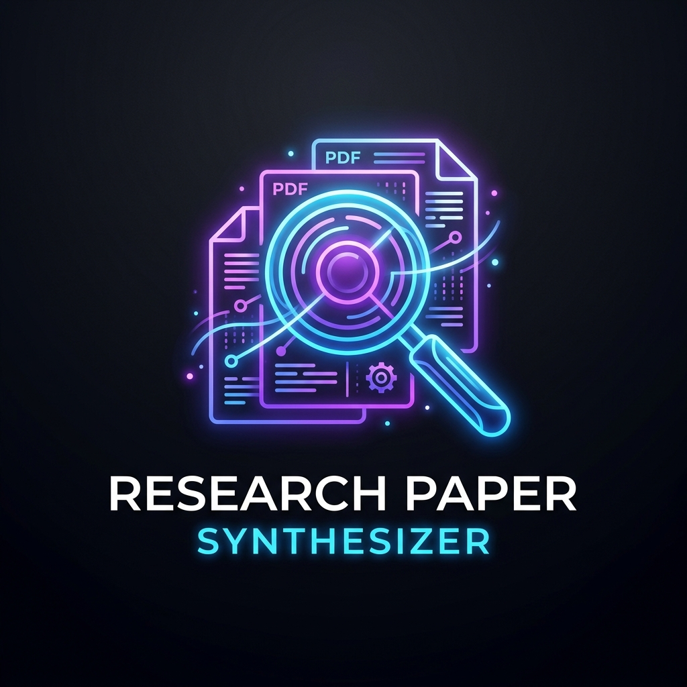
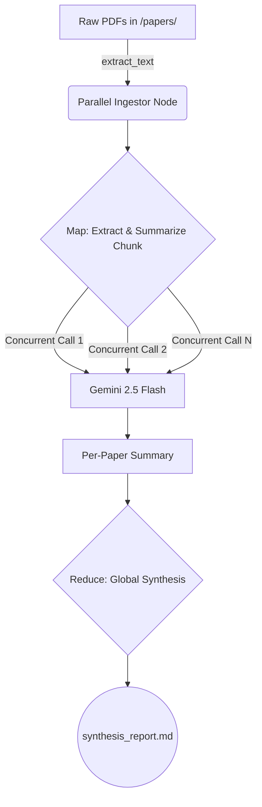

# Research Paper Synthesizer 🧠

<p align="center">
  
</p>

An intelligent, multi-agent AI pipeline that ingests, summarizes, and synthesizes multiple academic research papers in parallel using **Gemini 2.5 Flash** and `google-genai`.

## 🚀 Features
- **Parallel Chunking:** Processes massive PDF documents utilizing asynchronous concurrent evaluation.
- **Zero-Dependency NLP:** Stripped of heavy frameworks (like LangChain) to guarantee high reliability using pure native `asyncio`.
- **System Optimized:** Automatically overrides standard Windows Event Loop crashes.
- **Context Synthesis:** Employs an optimized cross-document final synthesis module.

## 📐 Architecture


## 🛠 Setup

**1. Clone and Enter Repository**
```bash
git clone https://github.com/your-username/ResearchPaperSynthesizer.git
cd ResearchPaperSynthesizer
```

**2. Configure Environment**
Create a `.env` file in the root directory and add your Google Gemini API key:
```env
GEMINI_API_KEY=your_actual_key_here
```

**3. Install Dependencies**
We recommend using a Virtual Environment (`venv`):
```bash
python -m venv venv
.\venv\Scripts\activate
pip install -r requirements.txt
```

**4. Execute Pipeline**
Drop your academic PDFs into the `papers/` directory and run:
```bash
python synthesizer.py
```

Generated Entirely with Vibe Coding.
